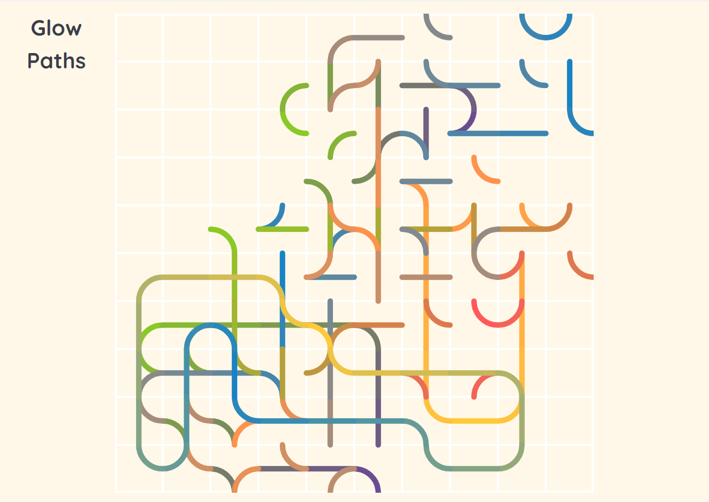

A puzzle game based on Truchet tiles and color gradients.

#### Instructions:

- Rotate the squares by clicking on them
- Every stroke belongs to a closed loop on the board
- Fully connect all loops to win

Try playing here: [https://glowpaths.netlify.app](https://glowpaths.netlify.app/)

In the example game below, the loop that runs through the bottom left corner is already complete.

